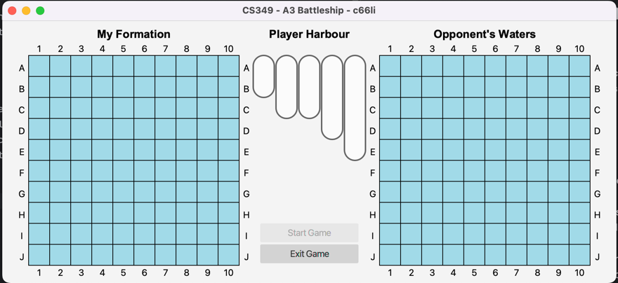
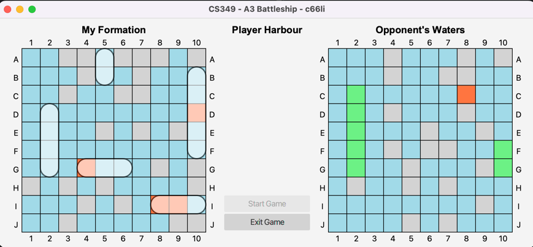
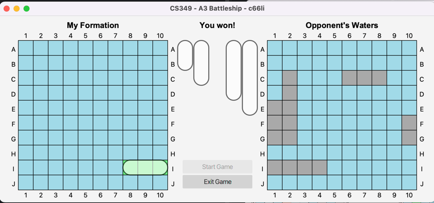

# Battleship Game
_UWaterloo CS329 User Interfaces (W23) Assignment 3_

This application is implemented with JavaFX's Graphics, Animations, Hit-Testing and Transformations.
The purpose of the application is to implement the board game [Battleship](https://en.wikipedia.org/wiki/Battleship_%28game%29).

## Features

- **Interactive Game Boards**: Includes a 10x10 player board and a 10x10 opponent board, with visually separated cells and labeled rows and columns.
- **Ship Placement and Management**: Players can select, move, and rotate ships from the Player Harbour to the Player Board with animated transitions and snapping to grid functionality.
- **Game Controls**: Start and Exit game buttons, with the Start Game button enabled only after all ships are placed. The AI places its ships once the game starts.
- **Gameplay Mechanics**: Players take turns attacking cells on the opponent board, with updates indicating hit, miss, and sunk states.
- **Game Resolution**: Displays win/loss messages upon game completion, with final ship positions and board states updated accordingly.

## Screenshot

## Setup
* macOS 12.1
* IntelliJ IDEA 2022.3.1 (Community Edition)
* Java SDK 17.0.5 (temurin)

## References
References were made to the CS349 W23 public repository for my implementation of this application. Specifically, the a3battleship starter code was referenced.

## Enhancement
No enhancement is made.
